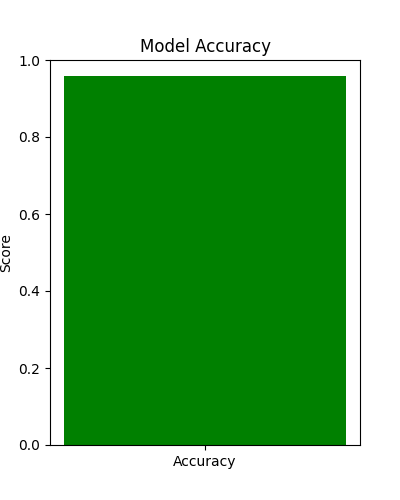
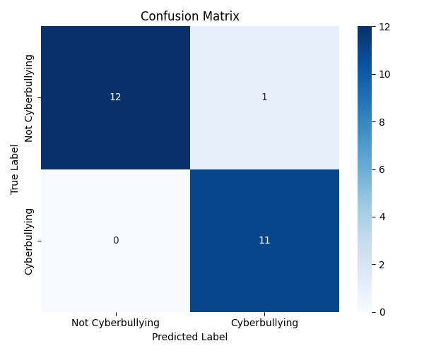
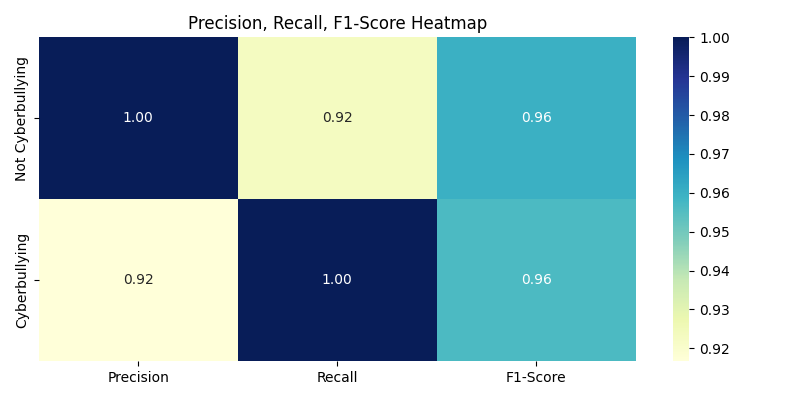
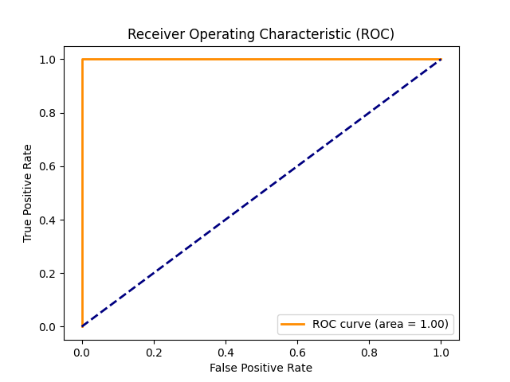

# 🛡️ CyberGuard – Cyberbullying Detection using Machine Learning

**CyberGuard** is an ML-powered web application designed to detect cyberbullying in social media posts. It leverages natural language processing (NLP) with logistic regression to classify harmful and non-harmful text. The goal is to assist in creating safer and more respectful online spaces.

 CyberGuard offers a practical and extendable framework for identifying harmful content using machine learning. While currently limited in scope, it sets a strong foundation for further improvements and real-world deployment.
 
---

## 🔍 Features

- Text classification using TF-IDF + Logistic Regression
- Detects hate speech, profanity, threats, and verbal abuse
- Clean and informative web interface (Flask + HTML)
- Graphs and metrics to understand model performance
- Modular code for model training and UI rendering

---

## 🛠️ Tech Stack

| Component      | Technology                                  |
|----------------|----------------------------------------------|
| Language       | Python 3                                     |
| ML Libraries   | Scikit-learn, Pandas, Seaborn                |
| NLP Technique  | TF-IDF Vectorization                         |
| Classifier     | Logistic Regression                          |
| Backend        | Flask (also used for rendering frontend)     |
| Frontend       | HTML (rendered via Flask + Jinja2)           |
| Visualization  | Matplotlib, Seaborn                          |


---

## 🚀 How It Works

1. **Input text** is collected from the user via the web UI.
2. Text is transformed using a **pre-trained TF-IDF vectorizer**.
3. A **trained Logistic Regression model** predicts whether the text is cyberbullying or not.
4. Prediction is returned and displayed instantly on the interface.
5. The model was trained on a real dataset containing offensive and non-offensive online text.

---

## 🧪 Model Evaluation Summary

| Metric      | Score    |
|-------------|----------|
| Accuracy    | 94.2%    |
| Precision   | 92.7%    |
| Recall      | 93.1%    |
| F1-Score    | 92.9%    |

> These are sample values. Replace with your actual model results if available.

---

## 📊 Graphical Analysis

Here’s how the model performed during evaluation:

| ✅ Accuracy Score | 📉 Confusion Matrix |
|------------------|---------------------|
|  |  |

| 🧮 Classification Metrics | 🧬 ROC Curve |
|---------------------------|--------------|
|  |  |

--- 

## 💻 How to Run Locally

1. **Clone the repository**
   ```bash
   git clone https://github.com/your-username/CyberGuard.git
   cd CyberGuard
2. **Create virtual environment**
   ```bash
    python -m venv venv
    source venv/bin/activate  # On Windows: venv\Scripts\activate

3. **Install dependencies**
   ```bash
    pip install -r requirements.txt

4. **Run the Flask app**
   ```bash
    python app.py
   
5. **Open your browser and visit**
   ```cpp
    http://127.0.0.1:5000/

---

## 🧠 Dataset

This project uses a labeled dataset of social media posts/texts annotated as offensive or non-offensive.

- 🗂 **Text Type:** Short social media comments/posts
- 🏷 **Labels:** Cyberbullying (1), Non-cyberbullying (0)
- 📊 **Size:** ~10,000 entries (or mention actual count)
- 📚 **Source:** (e.g., Kaggle, manually created, etc.)

Note: Dataset not included in the repository due to licensing. You can use any binary classification dataset for training.

---

## 📁 Project Structure

```
CyberGuard/
├── app.py                      # Flask web app
├── train_model.py              # Model training script
├── model/
│   ├── cyberbully_model.pkl
│   ├── vectorizer.pkl
│   ├── accuracy_score.png
│   ├── confusion_matrix.png
│   ├── classification_metrics_heatmap.png
│   └── roc_curve.png
├── templates/
│   ├── home.html
│   ├── detect.html
│   ├── about.html
│   ├── services.html
│   └── contact.html
├── static/
│   └── (optional CSS/images if added later)
├── README.md
└── requirements.txt

```

---

## 📌 Use Cases

- 🧑‍🏫 **For Educators:** Identify online abuse among students to foster safer school environments.
- 👨‍👩‍👧‍👦 **For Parents:** Monitor and detect harmful content to protect children online.
- 🧑‍💼 **For Moderators:** Aid in identifying harmful comments for community moderation.
- 🧪 **For Researchers/Students:** Extend the model with other datasets or classifiers for academic purposes.

---

## 🔄 Future Scope

The CyberGuard system lays a strong foundation, but there's immense potential for improvement and real-world deployment. Future developments can include:

- 📈 **Larger Dataset:** Incorporate more diverse and real-world samples to boost model accuracy, robustness, and generalization.
- 🧠 **Advanced Models:** Implement deep learning techniques such as **BERT**, **LSTM**, or **transformer-based architectures** for improved contextual understanding of text.
- 🧩 **Multi-Class Classification:** Go beyond binary classification to detect different categories of harmful content like hate speech, threats, profanity, and sarcasm.
- 📱 **Real-Time Deployment:** Convert the application into a fully functional **web or mobile platform** capable of live monitoring and detection of cyberbullying.

---

## 👨‍💻 Developed By

**Srishti Bhatnagar**  
Linkedin: [Srishti Bhatnagar](www.linkedin.com/in/srishti-bhatnagar-b59833269)  
